# D&D 5e Веб-Справочник

Веб-сервис для мгновенного доступа к игровой информации по Dungeons & Dragons 5th Edition. Сервис предназначен для игроков и мастеров, позволяя быстро находить данные о монстрах, заклинаниях и снаряжении прямо во время игры. Замена бумажным книгам и PDF-файлам на удобный интерактивный справочник с интеллектуальным поиском и фильтрацией.

**Ссылка на рабочий проект:** https://icecubeq.pythonanywhere.com/

## Ключевые возможности

- **База данных D&D 5e**: Монстры, заклинания и снаряжение из официальных источников
- **Поиск**: Возможность найти монстров, заклинания и снаряжение по названию
- **Фильтрация и сортировка**: По типу, уровню, школе магии, стоимости и другим параметрам
- **Похожие материалы**: При нажатии на карточку вы можете увидеть похожий контент
- **Избранное**: Сохранение часто используемых записей
- **Homebrew-контент**: Возможность добавлять собственные материалы
- **Модерация**: Административная панель для одобрения пользовательского контента
- **Адаптивный дизайн**: Работает на компьютерах, планшетах и смартфонах
- **Темная тема**: При желании вы можете включить темную тему

## Технологии

* **Backend:**
  - Python 3.10+
  - Django 4.2.7
  - Django ORM
  - SQLite3
* **Frontend:**
  - HTML5
  - CSS3
  - JavaScript (Vanilla JS)
  - Bootstrap 5
* **Интеграции:**
  - D&D 5e API (dnd5eapi.co)
  - Requests 2.32.5
* **Деплой и инфраструктура:**
  - PythonAnywhere (хостинг)
  - Whitenoise 6.11.0 (статичные файлы)
  - Gunicorn 21.2.0 (WSGI сервер)
  - Python-dotenv 1.2.1 (переменные окружения)

## Скриншоты

### Главная страница
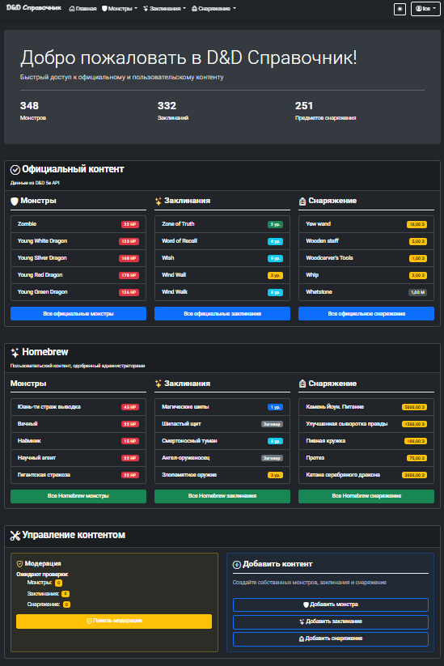
*Обзор статистики и последних добавлений*

### Список монстров
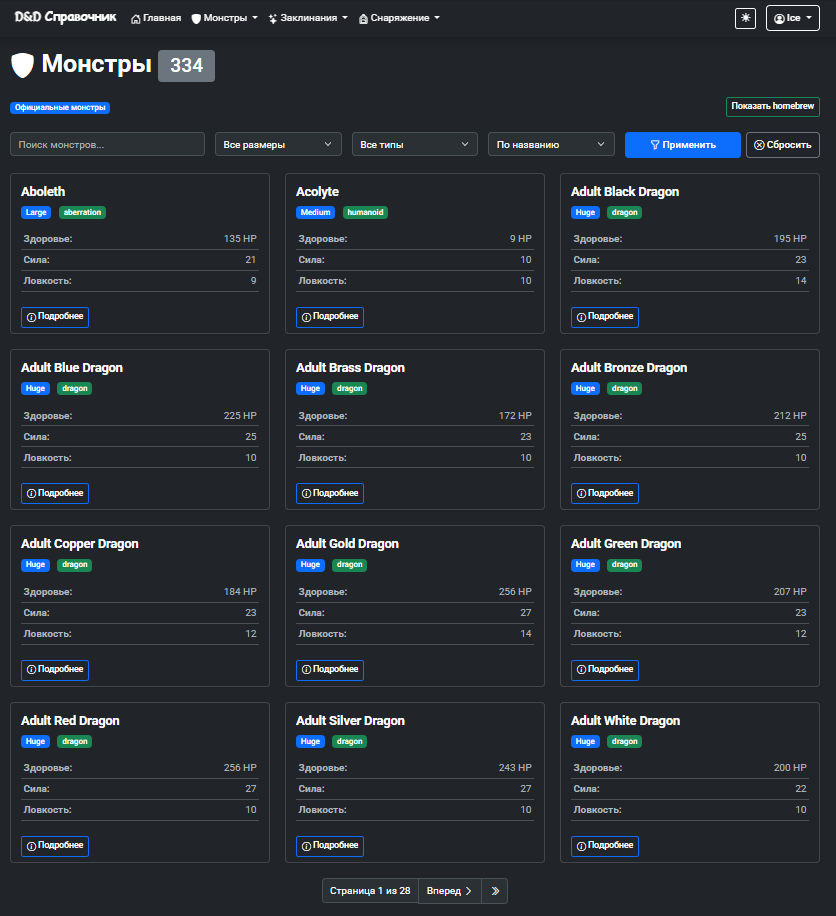
*Фильтрация и поиск по монстрам с детальной информацией*

### Детальная страница монстра
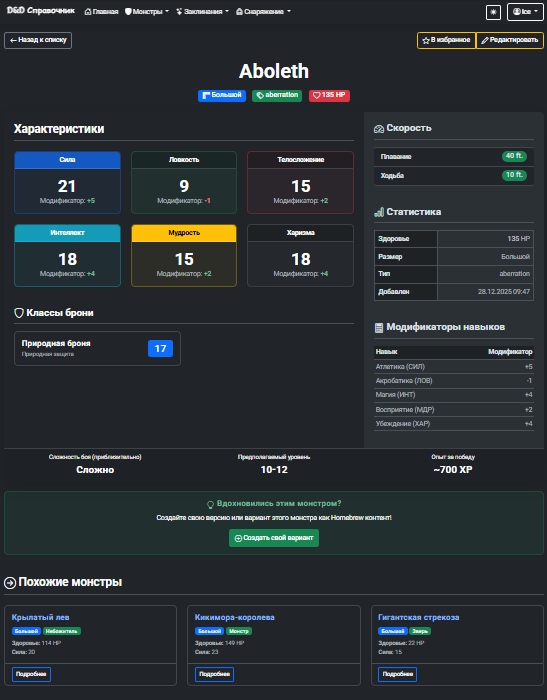
*Полная информация о монстре: характеристики, броня, скорости*

### Список заклинаний
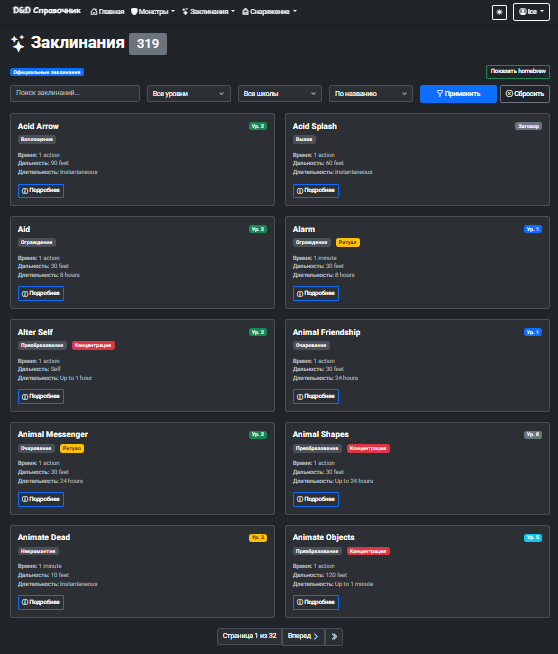
*Фильтрация по уровню и школе магии*

### Детальная страница заклинания
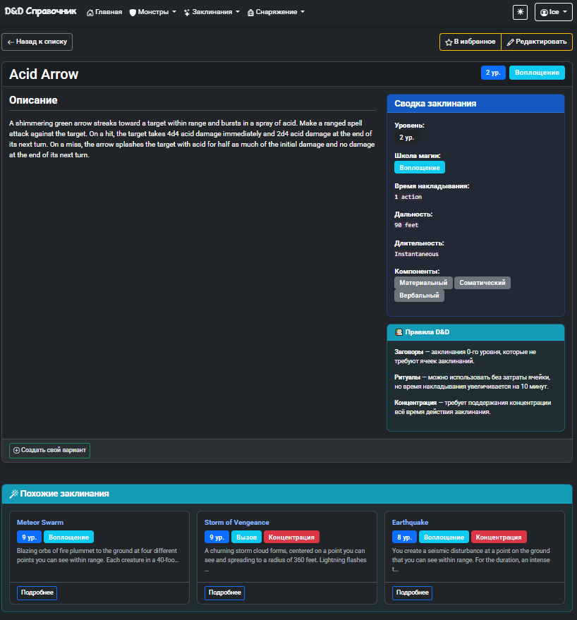
*Полная информация о заклинании: описание, дальность, компоненты*

### Список снаряжения
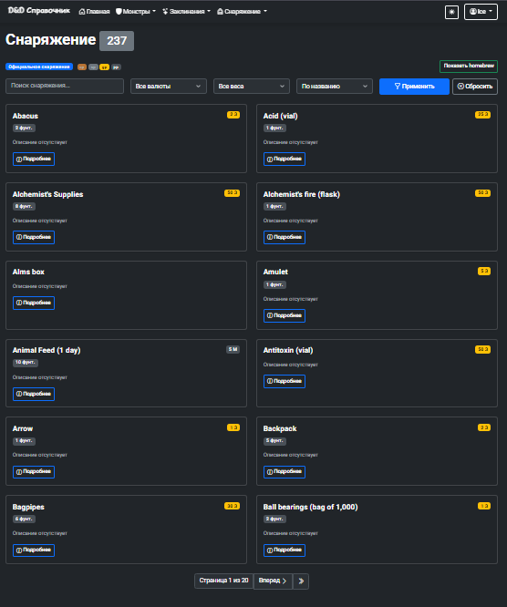
*Фильтрация по цене и весу*

### Детальная страница снаряжения
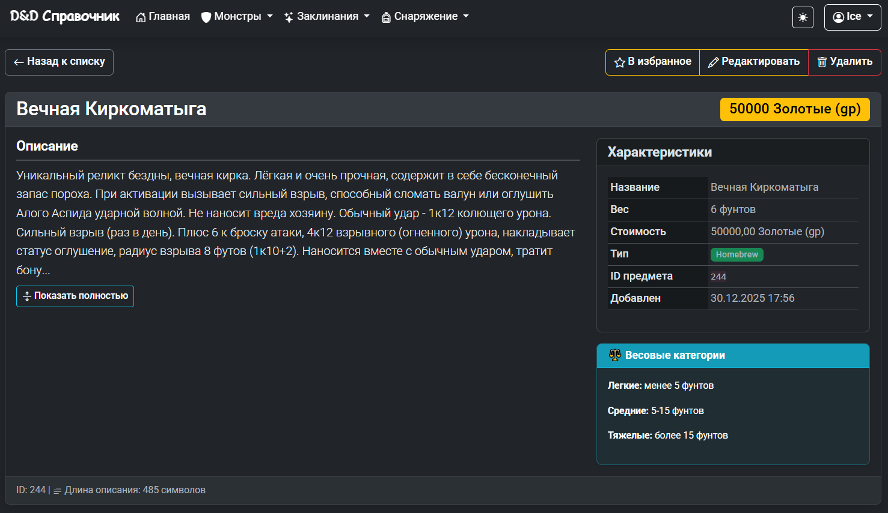
*Полная информация о заклинании: описание, вес, цена*

### Добавление монстра
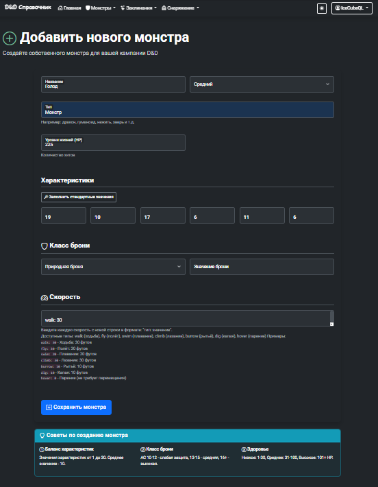
*Добавление нового монстра со своими характеристиками*

### Добавление заклинания
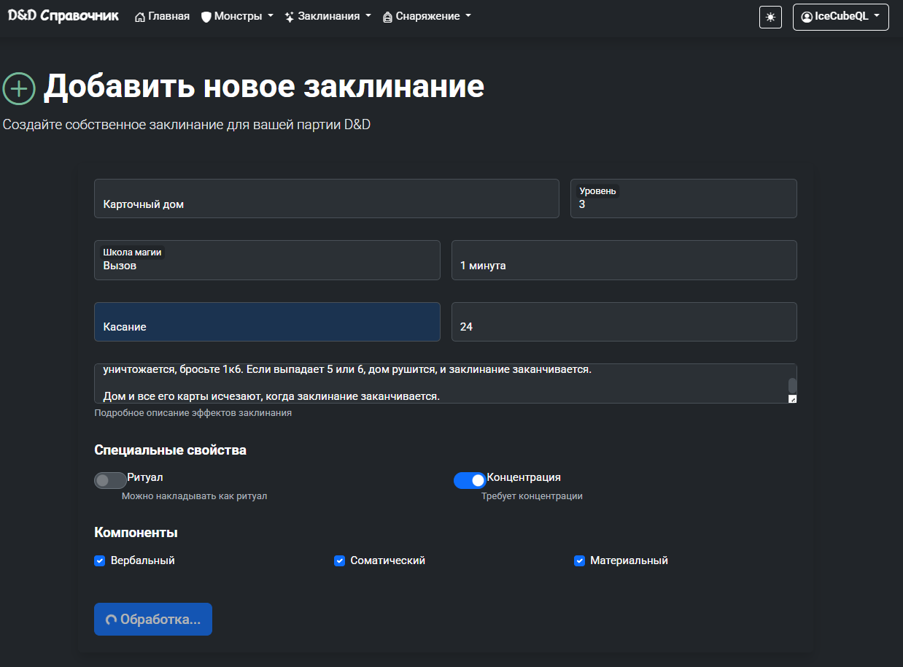
*Добавление нового монстра со своими характеристиками*

### Добавление снаряжения
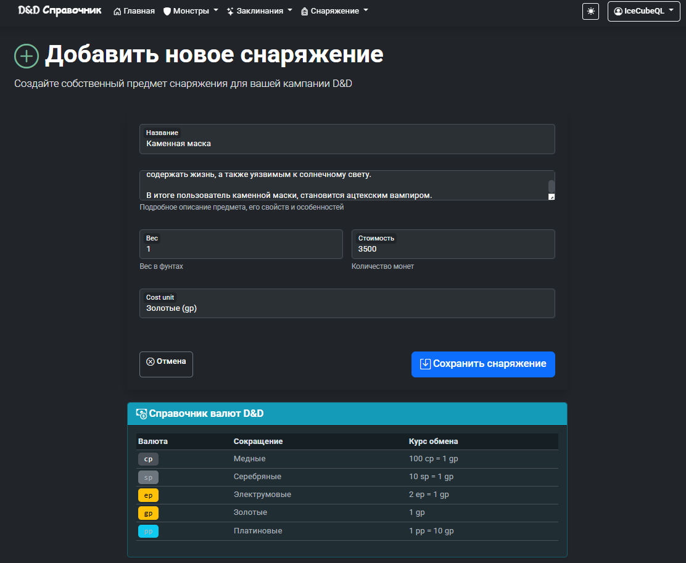
*Добавление нового снаряжения со своими параметрами*

### Административная панель
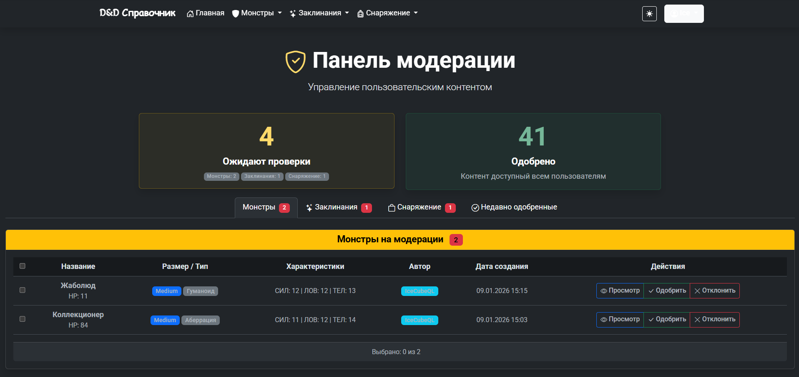
*Модерация пользовательского контента (homebrew)*

### Избранное
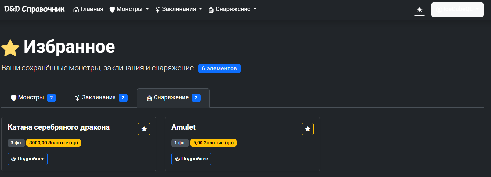
*Персональная коллекция часто используемых записей*

### Регистрация
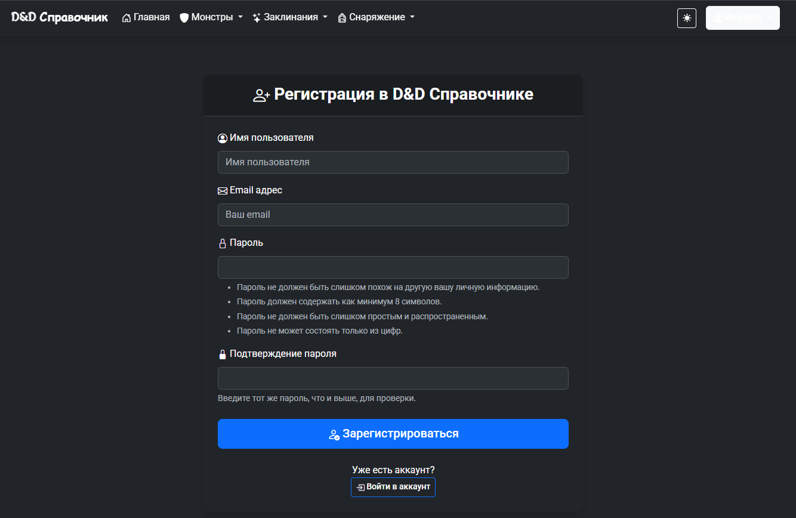
*Создание нового аккаунта*

### Вход
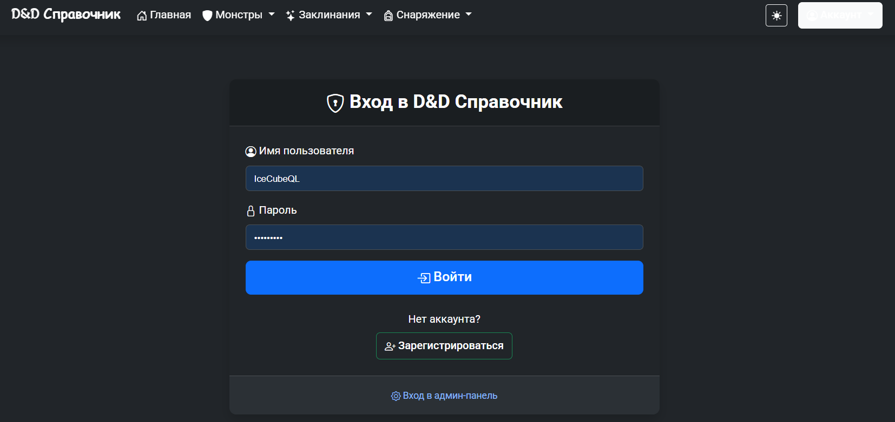
*Вход в свой аккаунт*

## Как запустить проект локально

### 1. Клонируйте репозиторий:

git clone https://github.com/IceCubeQq/PythonDnD.git

### 2. Создайте и активируйте виртуальное окружение:

Если не создалось виртуальное окружение, то создайте его:
# Для Linux/Mac:
python3 -m venv venv

# Для Windows:
python -m venv venv

Активируйте окружение, если оно еще не активировано:
# Для Linux/Mac:
source venv/bin/activate

# Для Windows:
.venv\Scripts\activate

### 3. Установите зависимости:
cd PythonDnD/DnDInfo

pip install -r requirements.txt

### 4. Настройте переменные окружения:

# Создайте файл .env:
python -c "
import string
import secrets
chars = string.ascii_letters + string.digits + '!@$%^&*()_-+=<>?/|[]{}~'
key = ''.join(secrets.choice(chars) for _ in range(50))
with open('.env', 'w', encoding='utf-8') as f:
    f.write(f'''SECRET_KEY={key}
DEBUG=True
ALLOWED_HOSTS=localhost,127.0.0.1,IceCubeQ.pythonanywhere.com
DND_API_URL=https://www.dnd5eapi.co/api''')
"

### 5. Примените миграции:

python manage.py makemigrations DnDSite
python manage.py migrate

### 6. Загрузите данные из D&D 5e API (довольно долго. При желании можете уменьшить количество данных):

python manage.py fetch_dnd_data --limit 350 

# Если будут ошибки, можно перезапустить команду

### 7. Создайте суперпользователя:

python manage.py createsuperuser
# Следуйте инструкциям для создания учетной записи администратора

### 8. Запустите сервер:

python manage.py runserver

### 9. Откройте проект в браузере:
Перейдите по адресу: http://127.0.0.1:8000

## Структура проекта
text
DnDInfo/
├── DnDSite/                  # Основное приложение
│   ├── models.py            # Модели данных
│   ├── views.py             # Представления
│   ├── forms.py             # Формы Django
│   ├── admin.py             # Административная панель
│   ├── services.py          # Бизнес-логика
│   ├── utils.py             # Утилиты (импорт данных из API)
│   └── constants.py         # Константы и настройки
├── templates/               # HTML шаблоны
│   └── DnDSite/
├── static/                  # Статические файлы
│   └── DnDSite/
│       ├── css/
│       ├── js/
│       └── images/
├── manage.py               # Управление Django
├── requirements.txt        # Зависимости
├── README.md              # Документация
└── TZ.md                  # Техническое задание

## API Интеграция
Проект использует официальное D&D 5e API для автоматической загрузки данных:

Базовая ссылка: https://www.dnd5eapi.co/api

## Роли пользователей
1. Гость
Просмотр официального контента

Использование поиска и фильтров

2. Зарегистрированный пользователь
Все возможности гостя

Добавление в избранное

Предложение собственного контента (homebrew)

3. Администратор/Мастер
Все возможности пользователя

Модерация пользовательского контента

Управление базой данных

Редактирование любых записей

## База данных
Основные модели:
Monster - монстры с характеристиками

Spell - заклинания с компонентами

Equipment - снаряжение и предметы

Favorite - избранные записи пользователей

Armor_class - типы брони монстров

Speed - скорости перемещения

Component - компоненты заклинаний

